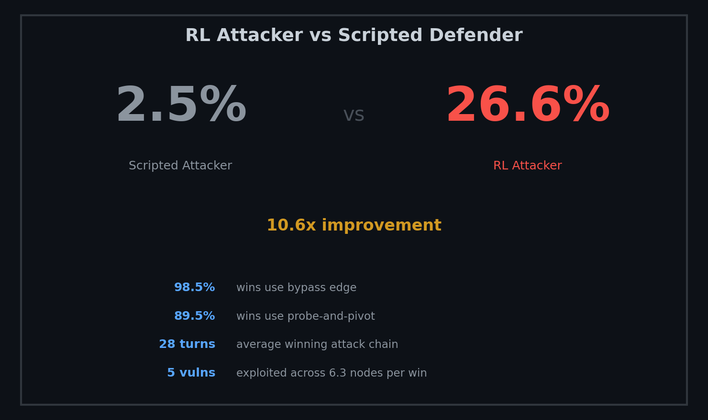
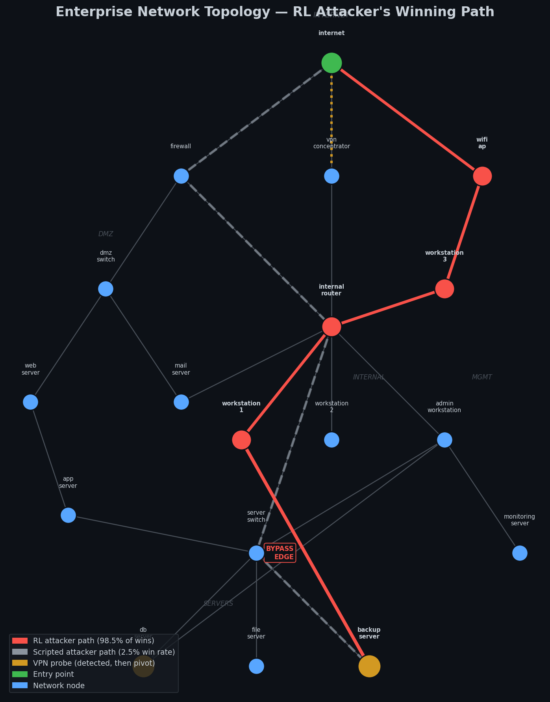
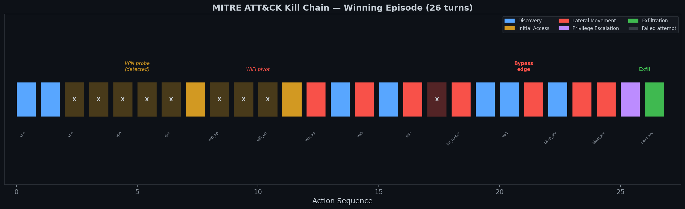
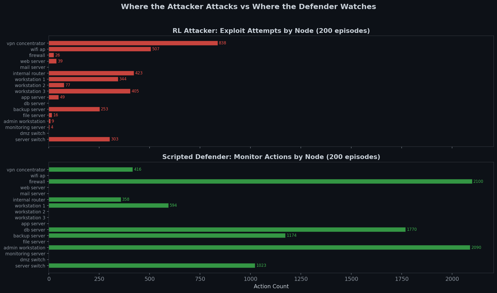
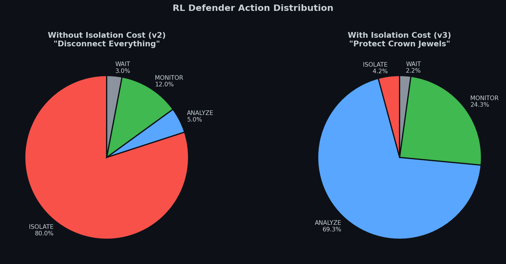
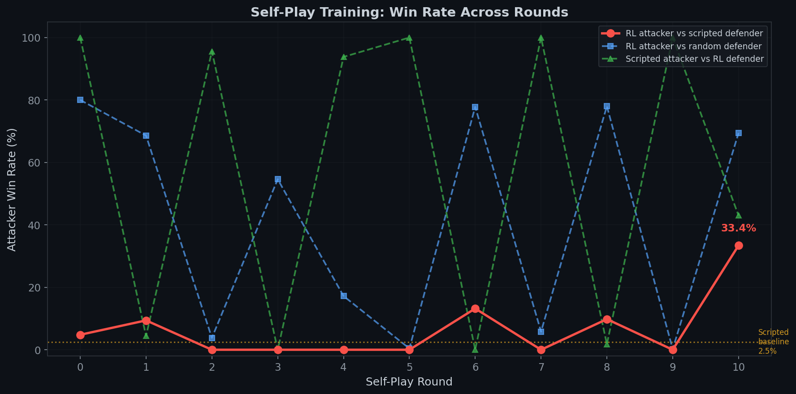

# RL Multi-Agent Network Security: Attacker vs Defender

Two RL agents compete inside a simulated enterprise network. The attacker learns to infiltrate and exfiltrate data. The defender learns to monitor, detect, and isolate. Neither agent is given a strategy — both learn through alternating self-play with opponent sampling (10% random / 20% scripted / 70% frozen checkpoint each round).

**Part 2 of a 3-part RL security project.**
Part 1 — [RL Adversarial IDS Evasion](https://github.com/MohammedSabith/rl-adversarial-ids-evasion): RL agent evades a peer-reviewed traffic classifier (92% evasion on Bot C&C, 80% on WebAttack).
Part 3 — World model RL for multi-step planning (coming soon).

---

## Results



The RL attacker wins **26.6%** against a rule-based defender that rotates monitoring across all chokepoints — a **10.6x improvement** over a scripted attacker baseline (2.5%). Evaluated over 500 episodes. (`history.json` records 33.4% from a different seed — the true rate is in the 26-33% range.)

---

## The Network



An 18-node enterprise topology with 5 subnets, 3 internet entry points (firewall, VPN, WiFi), and 2 high-value data targets. The attacker has 95 possible actions. The defender has 73. Both agents act once per turn for up to 60 turns.

---

## What the Attacker Learned



The scripted attacker follows the shortest feasible path through the main server switch (the defended chokepoint) and gets caught. The RL attacker learned three things automatically:

1. **Bypass edge discovery** — 131 out of 133 wins route through the workstation_1-to-backup_server connection (a backup agent path), bypassing the monitored chokepoint entirely. There are 21 viable paths to the backup server. The agent learned which ones avoid the defender's monitoring rotation.

2. **Probe-and-pivot** — In winning episodes, the agent consistently probes VPN first. When VPN is isolated by the defender, it pivots to WiFi. 89.5% of wins follow this pattern.

3. **Efficient escalation** — The agent only escalates privileges on the target node. The scripted attacker wastes turns escalating on every intermediate machine.



The mismatch tells the story: the attacker concentrates on VPN, WiFi, and the bypass path. The defender watches the firewall, admin workstation, and data servers. The gap is where the attacker wins.

---

## What the Defender Learned



In an early version with no isolation cost, the RL defender learned to disconnect every chokepoint in its opening moves. No path into the network exists. Game over. Technically optimal. Operationally useless.

Adding a small cost per isolated node per turn (modeling real-world downtime) changed the behavior completely. The defender went from isolating machines in 4 out of 5 opening moves to just 4.2% of all actions. It now concentrates isolation on the two data servers and `internal_router`, spending 90%+ of its time on analysis and monitoring.

---

## Training Dynamics



10 rounds of self-play, alternating between attacker and defender training. The attacker oscillates — rediscovering the bypass path in some rounds, losing it in others. The defender is strong enough that the RL attacker never beats the RL defender (0% win rate). The defender learns to preemptively isolate both data targets, which the attacker has no counter for without multi-step planning.

---

## Setup

```bash
python -m venv .venv
source .venv/bin/activate  # Windows: .venv\Scripts\activate
pip install -e ".[dev]"
```

**Requirements:** Python 3.10+, PyTorch (CPU is fine), ~2GB disk for dependencies.

---

## Run Baselines

```python
from netsim.evaluation.baselines import run_all_baselines, print_baseline_results

results = run_all_baselines("configs/scenarios/enterprise_v2.yaml", n_episodes=200)
print_baseline_results(results)
```

## Run Self-Play Training

```python
from netsim.training.self_play import self_play

history = self_play(
    "configs/scenarios/enterprise_v2.yaml",
    n_rounds=10,
    attacker_timesteps=200_000,
    defender_timesteps=100_000,
    eval_episodes=500,
    output_dir="results/self_play_v3",
    seed=0,
)
```

Training 11 rounds (3.3 million total steps) runs on a laptop CPU in about 50 minutes.

## Reproduce Figures

Four figures work immediately on a fresh clone (require only `results/self_play_v3/history.json`):

```bash
python scripts/generate_figures.py
```

Two figures (`kill_chain.png`, `node_heatmap.png`) and the trajectory statistics cited in the README (131/133, 89.5%, etc.) require trained model checkpoints. Run `self_play()` first, then:

```bash
python scripts/generate_figures_from_model.py
```

---

## Tests

```bash
pytest
```

83 tests across network model, environment mechanics, baselines, and training.

---

## Project Structure

```
configs/scenarios/     # YAML network topologies (5-node dev, 16-node, 18-node showcase)
src/netsim/
  network/             # NetworkX graph, YAML loader, node state models
  environment/         # Gymnasium envs (AttackerEnv, DefenderEnv), action spaces, GameEngine
  agents/              # ScriptedAttacker, ScriptedDefender baselines
  evaluation/          # run_matchup, run_all_baselines
  training/            # self_play loop, MaskablePPO, OpponentSamplingWrapper
results/
  figures/             # Visualizations
  self_play_v3/        # Training history (history.json)
scripts/
  generate_figures.py            # Figures from history.json (works on fresh clone)
  generate_figures_from_model.py # Figures requiring trained model checkpoints
tests/                 # 83 tests
```

---

## Technical Notes

- **Action masking** via MaskablePPO (sb3-contrib) — only valid actions at each state
- **Potential-Based Reward Shaping** for attacker (policy-invariant in tabular setting, works empirically with neural policies; provides gradient signal for ~28-step attack chains through probabilistic exploits)
- **Opponent sampling** — 10% random / 20% scripted / 70% frozen checkpoint (prevents catastrophic forgetting)
- **Isolation cost** — 0.003/node/turn penalizes mass-isolation, forces real defensive trade-offs
- **Asymmetric training budget** — 200K steps/round attacker, 100K defender
- Built from scratch — existing frameworks (CybORG, NASim, YAWNING-TITAN) had gaps for this use case

---

*Python 3.12 · Stable-Baselines3 2.7 · sb3-contrib 2.7 · Gymnasium 1.2 · NetworkX 3.6 · PyTorch 2.10*
